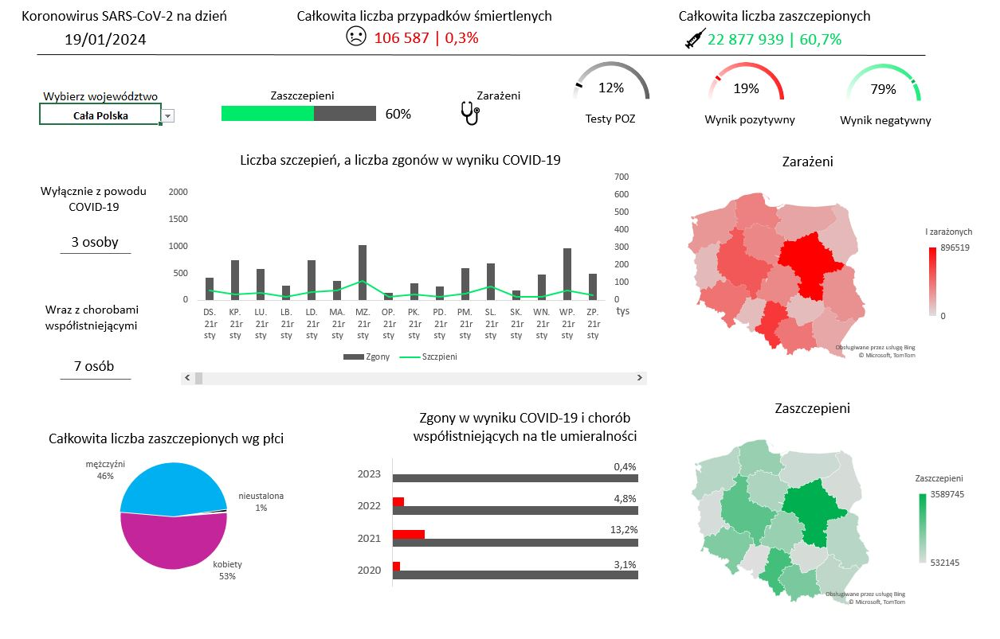

<h2><b>Podstawowe umiejętności techniczne</b></h2>
<h4 style="font-weight: lighter">Excel, Power BI, Power Query, VBA, HTML, SQL & data visualization </h4>

<h2> <b>Edukacja</b></h2>
<h4 style="display:inline; line-height:0px; color:black">Politechnika Rzeszowska</h4>
<h4 style="font-weight: lighter">Elektronika i telekomunikacja - dzienne studia inżynierskie</h4>

<h2> Doświadczenie</h2>
<h4 style="display:inline; line-height:0px; color:black">Wsparcie laboratoryjne @ Intel(07.2022 - 07.2023)</h4>
- wsparcie obsługi laboratoriów komputerowych
- zaprogramowanie formularza automatyzującego w Excelu wykorzystując wewnętrzne formuły i język VBA
- wykonywanie raportów w Excelu na żądanie
- przeprowadzanie rozmów technicznych kwalifikujących do pracy
- tymczasowe koordynowanie zespołem
- doradztwo techniczne dla klientów polskich i zagranicznych
- wykonywanie szkoleń dla nowych pracowników
- wypełnianie danych w systemowych bazach 
- diagnostyka i naprawa sprzętu komputerowego
- weryfikacja dokumentacji technicznych 

<h4 style="display:inline; line-height:0px; color:black">Inżynier procesu @ Aptiv (04.2022 - 06.2022)</h4>
- rozwiązywanie problemów technicznych i jakościowych
- przygotowanie i analizowanie raportów w Excelu celem prezentacji na spotkaniach z menadżerami
- nadzór nad dokumentacją produktów
- prowadzenie i utrzymywanie akcji tymczasowych na produkcji

<h4 style="display:inline; line-height:0px; color:black">Dział wsparcia @ GrupaWW/staż (08.2020-09.2020)</h4>
- zabezpieczanie stron www postawionych na Wordpresie
- przeprowadzanie szkoleń z bezpieczeństwa sieciowego dla wszystkich pracowników firmy
- instalacja systemów operacyjnych
- konfiguracja klienckiego G Suita
- prowadzenie kont hostingowych firmy i klientów

<h2> Projekty</h2>
<h4 style="display:inline; line-height:0px; color:black">Formularz automatyzujący </h4>

&emsp;&emsp;&ensp;Projekt został wykonany na potrzeby firmy. Miał za zadanie poprawić ogólny sposób realizowania procedur systemowych. Wprowadzona automatyzacja powielanych zadań przyśpieszyła czas agregacji danych i zmniejszyła liczbę błędów. Dodatkowo formularz został wyposażony w możliwość generowania automatycznych emaili, co zostało osiągnięte przy pomocy HTML. 

<h4 style="display:inline; line-height:0px; color:black">Projekt Covid-19</h4>

&emsp;&emsp;&ensp;W czasie postpandemicznym ze zwykłego zainteresowania oraz dla celów prezentacyjnych wykonałem <i>Pulpit nawigacyjny</i>. Dashboard został zaprojektowany zgodnie z przyjętymi standardami projektowania i wizualizowania danych w świecie "Data science". Projekt korzysta z rządowych danych <u>gov.pl</u> oraz <u>GUS.pl</u> (Główny Urząd Statystyczny). Ze względu na ogromną liczbę danych został oparty na silniku ETL - Power Query. Dashboard  składa się z wielu elementów wizualizacyjnych m.in. paska postępu, wykresów miernikowych, słupkowych czy map, które przedstawiają informację o zarażeniach i zaszczepieniach z perspektywy całego kraju lub poszczególnych województw. <i>Pulpit nawigacyjny</i> dzięki wyposażeniu w elementy dynamiczne zmienia swoje wartości automatycznie do wyboru użytkownika. Z perspektywy projektu najważniejesze wskaźniki KPI zostały umieszczone w lewej, górnej części pulpitu. Dasboard został wyposażony w wykres kombi, który prezentuje korelację zestawienia zgonów i szczepień dla danych województw. Dane dzięki Power Query zostały zaagregowane dla każdego województwa w każdym miesiącu trwania pandemii. Suwak przewijania umożliwia prześledzenie również danych historycznych. 

  

<h2> Certyfikaty</h2>
- CISCO CCNA v7 "Introduction to network"
- CISCO CCNA v7 "Switching, Routing and Wireless Essentials"
- CISCO CCNA v7 "Enterprise Networking, Security and Automation"
- kurs obługi programów biurowych MS Office ECDL

