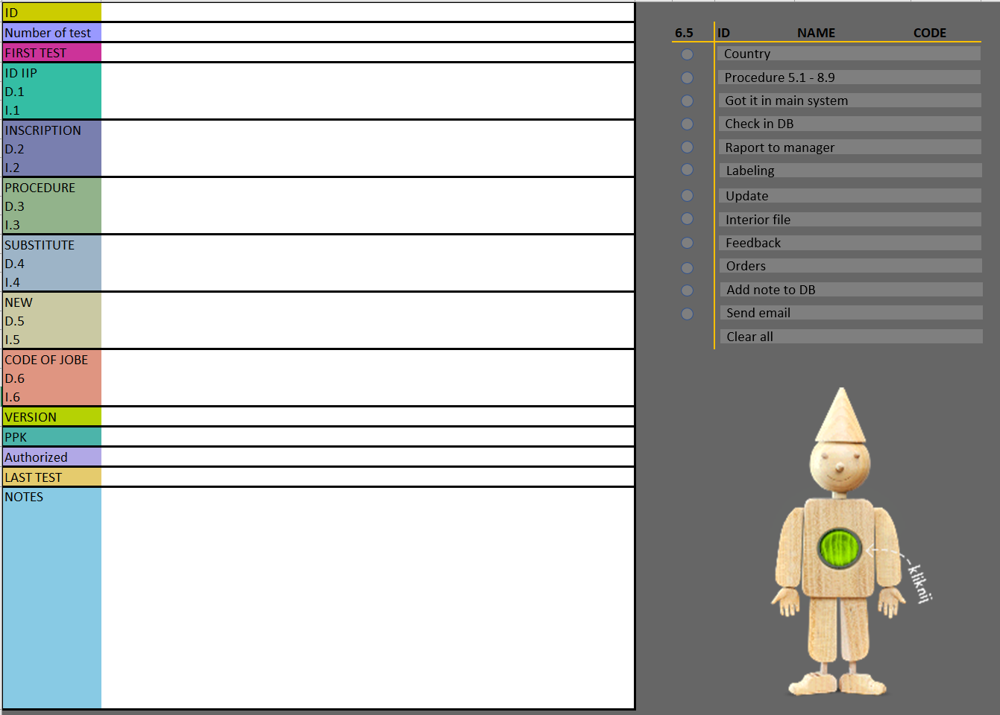

<h2><b>Podstawowe umiejętności techniczne</b></h2>
<h4 style="font-weight: lighter">Excel, Power BI, Power Query, VBA, HTML, SQL & data visualization </h4>

<h2> <b>Edukacja</b></h2>
<h4 style="display:inline; line-height:0px; color:black">Politechnika Rzeszowska</h4>
<h4 style="font-weight: lighter">Elektronika i telekomunikacja - dzienne studia inżynierskie</h4>

<h2> Doświadczenie</h2>
<h4 style="display:inline; line-height:0px; color:black">Własny projekt IT w przestrzeni data science (08.2023 - aktualnie)</h4>
 
<h4 style="display:inline; line-height:0px; color:black"></h4>

<h4 style="display:inline; line-height:0px; color:black">Wsparcie laboratoryjne @ Intel (07.2022 - 07.2023)</h4>
- wsparcie obsługi laboratoriów komputerowych
- zaprogramowanie formularza automatyzującego w Excelu wykorzystując wewnętrzne formuły i język VBA
- wykonywanie raportów w Excelu na żądanie
- przeprowadzanie rozmów technicznych kwalifikujących do pracy
- tymczasowe koordynowanie zespołem
- doradztwo techniczne dla klientów polskich i zagranicznych
- wykonywanie szkoleń dla nowych pracowników
- wypełnianie danych w systemowych bazach 
- diagnostyka i naprawa sprzętu komputerowego
- weryfikacja dokumentacji technicznych 

<h4 style="display:inline; line-height:0px; color:black">Inżynier procesu @ Aptiv (04.2022 - 06.2022)</h4>
- rozwiązywanie problemów technicznych i jakościowych
- przygotowanie i analizowanie raportów w Excelu celem prezentacji na spotkaniach z menadżerami
- nadzór nad dokumentacją produktów
- prowadzenie i utrzymywanie akcji tymczasowych na produkcji

<h4 style="display:inline; line-height:0px; color:black">Dział wsparcia @ GrupaWW/staż (08.2020-09.2020)</h4>
- zabezpieczanie stron www postawionych na Wordpresie
- przeprowadzanie szkoleń z bezpieczeństwa sieciowego dla wszystkich pracowników firmy
- instalacja systemów operacyjnych
- konfiguracja klienckiego G Suita
- prowadzenie kont hostingowych firmy i klientów

<h2> Projekty</h2>
<h4 style="display:inline; line-height:0px; color:black">Formularz automatyzujący </h4>

&emsp;&emsp;&ensp;Projekt powstał na potrzeby firmy. Miał na celu usprawnienie ogólnego sposobu wdrażania procedur systemowych. Wprowadzona automatyzacja zadań duplikowanych przyspieszyła czas agregacji danych i zmniejszyła liczbę błędów. Dodatkowo formularz został wyposażony w możliwość generowania automatycznych wiadomości e-mail, co zostało osiągnięte również za pomocą HTML. Projekty zostały pięknie zaprojektowane i okazały się bardzo pomocne, zwłaszcza dla nowych pracowników, którzy mają problem z ogromną liczbą procedur. Użyłem kodu VBA do wielu funkcji, na przykład czyszczenia arkusza, aktualizacji bieżącej notatki, oznaczania wykonanej pracy, kopiowania wybranych komórek i wielu innych. Ze względu na wewnętrzne procedury poufności danych wiele rzeczy zostało zmienione.  

  

<h4 style="display:inline; line-height:0px; color:black">Cenralizacja</h4>

&emsp;&emsp;&ensp;Dostałem zlecenie z zewnętrznej firmy na wykonanie pulpitu nawigacyjnego w Power BI. Firma do tej pory nie miała scentralizowanego systemu monitorowania przepływów pieniędzy oraz kosztów, które były trudne do uwzględnienia w starym systemie. Ten pulpit nawigacyjny informuje o aktualnym budżecie oraz kosztach dodatkowych jako wskażnikach KPI. Ponadto użytkownik ma możliwość wglądu w najważniejsze informacje ze względu na budżet ogólny w poszczególnych miesiącach, a także ze względu na skupowany materiał oraz magazyny. Aby sprostać wyzwaniom klienta musiałem zmienić domyślne ustawienia wyświetlania głównego wykresu i zastosować tzw. tooltip. Opróćz tego przygotowałem specjalną listę danych szczegółowych, gdzie klient od razu może mieć wgląd w interesujące pozycje. Pulpit nawigacyjny został wykonany zgodnie z procedurami wewnętrznej firmy. Natomiast sam pulpit nawigacyjny jest pięknie zaprojektowany z myślą o intuicyjności i prostocie.   

  

<h4 style="display:inline; line-height:0px; color:black">Projekt Covid-19</h4>

&emsp;&emsp;&ensp;Po pandemii byłem ciekawy prawdziwych statystyk dotyczących zarażonych, ponieważ z wiele źródeł płyneły różne fakty. Najgorsze było to, że w wielu przekazach informacyjnyh stosowano emocjonalne treści. Postanowiłem więc odciąć się od tego bałaganu i spróbować dowiedzieć się, gdzie jest prawda? Bardzo chciałem zrobić ten projekt dla siebie i rodziny. Zrobiłem pulpit nawigacyjny w Excelu. Zrobiłem go zgodnie z procedurami wizualizacji danych. Projekt wykorzystywał kilka źródeł danych: rządową stronę internetową gov.pl, Główny Urząd Statystyczny GUS.pl, platformę P1 Centrum Zdrowia e-zdrowie oraz rządową agencję rezerw materiałowych. Aby poradzić sobie z tak dużą ilością danych, użyłem silnika ETL w Excelu - Power Query. Pulpit nawigacyjny składa się z wielu wizualizacji, na przykład paska postępu, wykresów wskaźnikowych, wykresów słupkowych i map, co okazało się trafnym rozwiązaniem do pokazywaniu informacji o zarażonych i zaszczepionych w perspektywie krajowej i wojewódzkiej. Pulpit nawigacyjny jest dynamiczny, co w pewien sposób automatycznie prezentuje pożądane informacje. Ustawiłem dwa wskaźniki KPI, które znajdują się po lewej stronie u góry. Użyłem wykresu łączonego do przedstawienia korelacji zgonów i szczepień dla danych województw. Dzięki Power Query udało mi się zagregować dane dla każdej prowincji. Ponadto użytkownicy mogą analizować dane historyczne za pomocą postępu słupkowego. 

  

<h2> Certyfikaty</h2>
- CISCO CCNA v7 "Introduction to network"
- CISCO CCNA v7 "Switching, Routing and Wireless Essentials"
- CISCO CCNA v7 "Enterprise Networking, Security and Automation"
- kurs obługi programów biurowych MS Office ECDL

